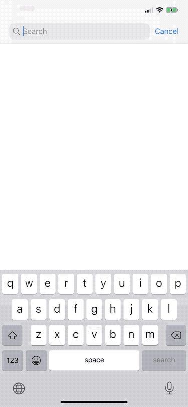

# Demo iOS application

The app uses [Songkick API](https://www.songkick.com/developer) to search for artists and fetch their events.

It persists the artist's events to storage and if there is no internet connection, it will show previously downloaded events. If there is no internet and no previously available data, it displays an error.

#### This project uses:

- Swift
- Protocol-Oriented Programming
- MVVM architecture
- ReactiveCocoa/ReactiveSwift as FRP framework
- URLSession, Codable for networking
- Core Data for persistent storage

